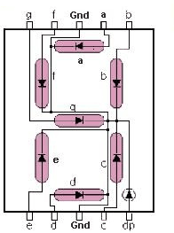

# Temperature Sensor
Current temperature displaying project using Arduino, DHT sensor and two 7-segment displays

There are no extra components used, therefore all digital pins and one analog pin are used.

The default wiring is shown below.
```
first digit:
  segment A -> pin 0
  segment B -> pin 1
  ...
  segment G -> pin 6

second digit:
  segment A -> pin 7
  segment B -> pin 8
  ...
  segment G -> pin 13
```

Following picture demonstrates the segments on the display and corresponding pins (taken from http://arduinonavody.cz/7-segmentovy-displej-a-jeho-zapojeni/).


If you use different wiring, simply change the constants to corresponding pins.

DHT (DHT22 by default, it can be changed to DHT11 or DHT21 changing the `DHTTYPE` constant) sensor uses pin A0, which can be changed using `DHTPIN` constant.
